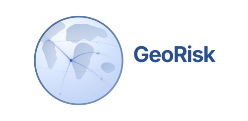
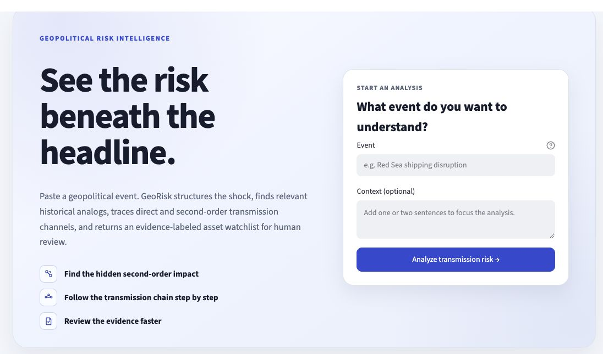
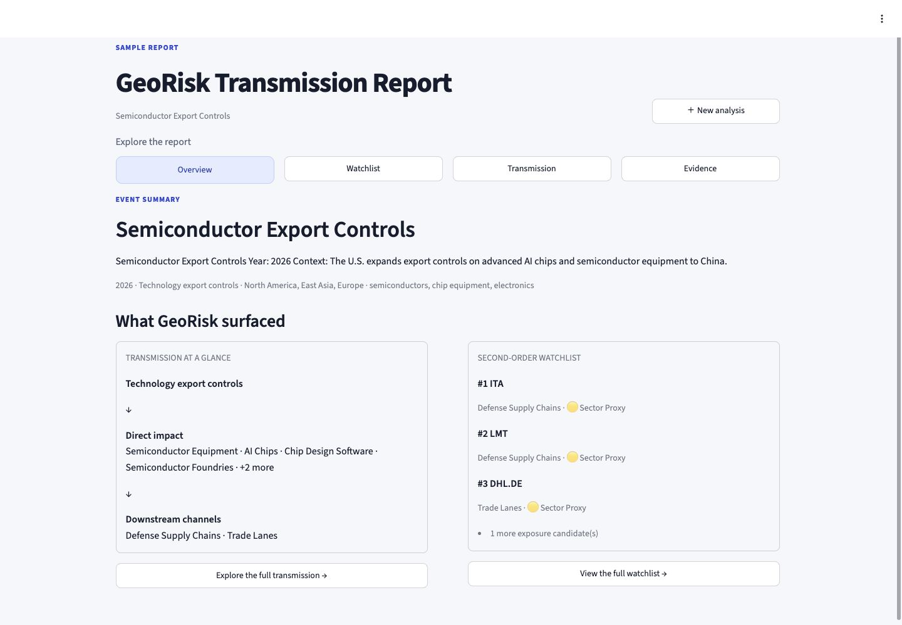
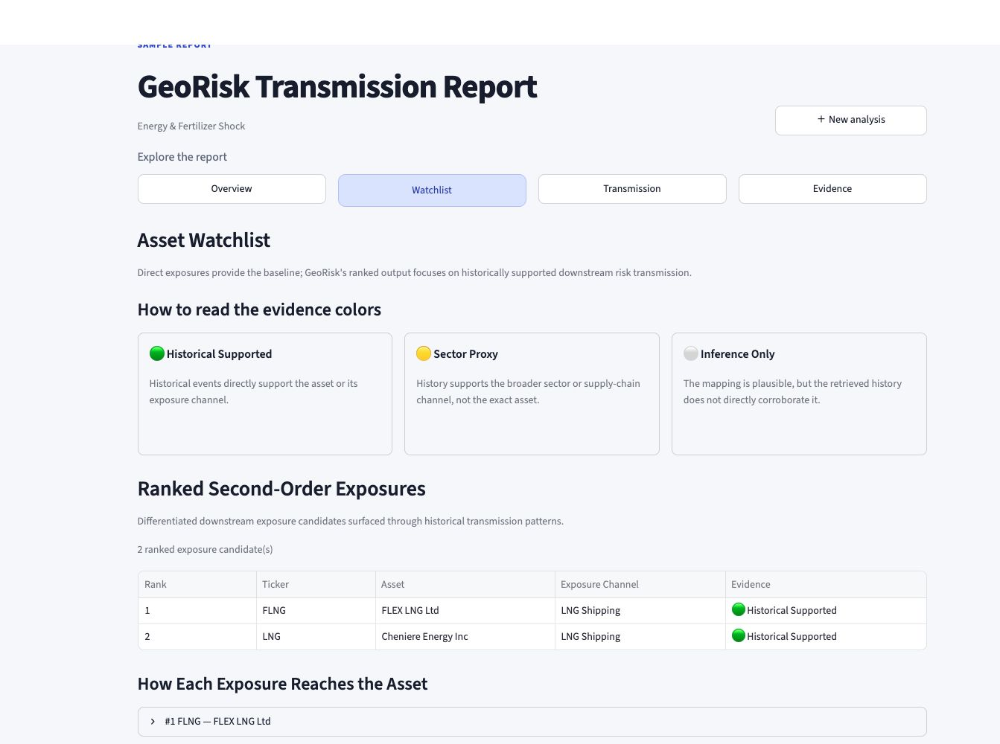
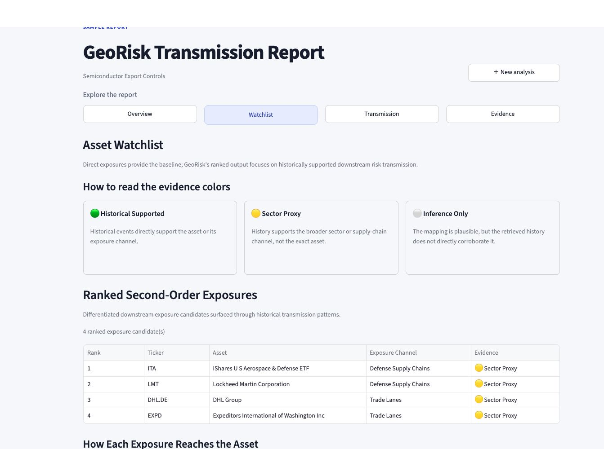

## See the risk beneath the headline.

**GeoRisk turns a geopolitical event into a traceable map of market exposure.**

Describe a shock or paste a headline. GeoRisk structures the event, retrieves relevant historical analogs, traces how the impact can move through industries and supply chains, and returns an evidence-labeled asset watchlist for human review.

**[Launch the live product →](https://georisktrace.com)** · [See an example](#see-georisk-in-action) · [Run locally](#run-georisk-locally)



---

## Why GeoRisk?

The obvious impact of a geopolitical event is usually easy to see. The harder—and often more useful—question is **what happens next**.

A shipping disruption may start at a chokepoint and spread into freight costs, insurance, manufacturing inputs, and downstream industries. Export controls may begin with one technology and reach equipment makers, supply-chain partners, data infrastructure, or defense exposure.

Those less-visible paths are easy to miss when research is fragmented across headlines, historical cases, sector knowledge, and asset screening—especially when time is limited.

GeoRisk helps answer three questions:

1. **Where can this shock travel beyond its first-order impact?**
2. **Which historical events support that transmission path?**
3. **Which assets may deserve closer human review?**

### What GeoRisk adds

| | Product capability | Why it matters |
| :---: | :--- | :--- |
| **01** | **Discover second-order effects** | Move beyond the industries and assets already obvious from the headline. |
| **02** | **Follow the transmission chain** | See the reasoning path from the shock to downstream exposure channels. |
| **03** | **Review the supporting evidence** | Inspect historical analogs instead of accepting an unexplained result. |
| **04** | **Start human research faster** | Turn a fragmented search process into a structured first-pass review. |

> [!IMPORTANT]
> GeoRisk does not predict prices, recommend trades, or provide investment advice. It surfaces exposure candidates and analytical paths for human review.

## Who is it for?

| Audience | How GeoRisk helps |
| :--- | :--- |
| **Buy-side and sell-side analysts** | Quickly screen possible transmission channels and exposures that headline-first research may overlook. |
| **Geopolitical, policy, sector, and supply-chain researchers** | Connect events, industries, operating channels, historical analogs, and candidate assets in one workflow. |
| **Professionals monitoring market-moving events** | Build a structured first view before deeper due diligence begins. |
| **Finance, economics, and political-science students** | Learn how geopolitical shocks can travel across industries and connect to real-world assets. |
| **Anyone following geopolitics and markets** | Explore what may sit beneath the most obvious headline impact. |

GeoRisk is not meant to replace domain expertise. It is designed to make the first hour of research faster, more structured, and easier to challenge.

## See GeoRisk in action

### Example · Semiconductor Export Controls

Suppose advanced-chip and semiconductor-equipment exports are restricted. The immediate technology impact is visible. GeoRisk helps the user investigate what sits beyond it: direct operating nodes, downstream exposure channels, candidate assets, and the historical evidence behind each path.



The report unfolds across four connected views:

| Step | View | What the user can do |
| :---: | :--- | :--- |
| **1** | **Overview** | Understand the event and scan the direct and downstream impact at a glance. |
| **2** | **Watchlist** | Review candidate assets and see the strength of supporting evidence. |
| **3** | **Transmission** | Follow the path from the initial shock through industries and supply-chain channels. |
| **4** | **Evidence** | Inspect the historical events that support the analysis. |

This progressive flow keeps the result reviewable: event first, candidates second, reasoning third, and supporting history last.

### Compare two watchlists

The watchlist is not a generic list of tickers. GeoRisk distinguishes **how strongly history supports each exposure**, so users can tell direct historical backing from a broader proxy relationship.

#### Energy & Fertilizer Shock · historically supported

For this event, retrieved historical cases directly support the LNG Shipping exposure channel and its mapped assets. The watchlist therefore labels FLNG and LNG as **Historically Supported**.



#### Semiconductor Export Controls · sector proxy

For this event, history supports the broader Defense Supply Chains and Trade Lanes channels, but does not directly corroborate the exact assets. GeoRisk keeps that distinction visible with the **Sector Proxy** label.



Together, the examples show why the evidence label matters: two assets can both be relevant for review without having the same level of historical support.

## How it works

| Stage | GeoRisk does | Produces |
| :---: | :--- | :--- |
| **01 · Understand** | Structures the geopolitical event | Regions, industries, shock direction, and direct exposure nodes |
| **02 · Retrieve** | Finds historical analogs | Past events with relevant geopolitical mechanisms |
| **03 · Trace** | Builds the transmission chain | Direct and downstream supply-chain channels |
| **04 · Review** | Maps evidence to assets | An evidence-labeled watchlist for human inspection |

```text
Headline → Structured shock → Historical analogs → Transmission channels → Asset watchlist
```

## Evidence you can read at a glance

GeoRisk keeps historical support and inference visibly separate.

| Label | Meaning |
| :--- | :--- |
| 🟢 **Historically Supported** | Retrieved historical events directly support the asset or its exposure channel. |
| 🟡 **Sector Proxy** | History supports the broader sector or supply-chain channel, not the exact asset. |
| ⚪ **Inference Only** | The mapping is plausible, but retrieved history does not directly corroborate it. |

If no second-order candidate clears the current support rules, GeoRisk returns no qualified ranking. That is a valid analytical result—not a system failure.

## Try the live product

Visit **[georisktrace.com](https://georisktrace.com)** to:

- analyze a geopolitical event of your own;
- open the **Semiconductor Export Controls** sample; or
- explore the **Energy & Fertilizer Shock** sample.

No local setup is required.

## Run GeoRisk locally

### Docker

```bash
git clone https://github.com/ViviLoveAI/GeoRiskAgent.git
cd GeoRiskAgent
docker compose up --build
```

Open the web UI at [http://localhost:8501](http://localhost:8501) or the API docs at [http://localhost:8000/docs](http://localhost:8000/docs).

### Python

```bash
git clone https://github.com/ViviLoveAI/GeoRiskAgent.git
cd GeoRiskAgent

python -m venv .venv
source .venv/bin/activate
python -m pip install -r requirements.txt

# Build the local retrieval index on first use.
GEORISK_LOCAL_MODEL_FILES_ONLY=false \
  python -m src.vector_store_health --rebuild

# Terminal 1: API
PYTHONPATH=. uvicorn src.api:app --host 127.0.0.1 --port 8000

# Terminal 2: Web UI
GEORISK_API_URL=http://127.0.0.1:8000 \
  PYTHONPATH=. python -m streamlit run app.py
```

The default rule-based event analysis works without an API key. Optional OpenAI-powered event structuring can be enabled through `.env.example`.

## Built for visible provenance

GeoRisk uses explicit, reviewable analysis stages rather than presenting a black-box conclusion:

- **Event Analyst** structures the event and immediate exposure context.
- **Case Retriever** finds relevant analogs in the curated historical-case library.
- **Transmission Builder** traces direct and downstream paths.
- **Mechanism Check** rejects superficial matches without a compatible mechanism.
- **Asset Mapper** maps exposure nodes to the controlled asset universe.
- **Evidence & Ranking** labels support strength and orders qualified candidates for review.

Project inputs remain local and auditable:

- candidate assets are loaded from `data/asset_mapping.csv`;
- historical cases are loaded from `data/historical_cases.json`;
- outputs remain analytical explanations, not financial recommendations.

See the [Data Policy](docs/DATA_POLICY.md) for repository and generated-data boundaries.

## Current boundaries

- Results depend on the coverage of the curated historical cases and asset mapping.
- A plausible path may be omitted when compatible historical support is not found.
- Mechanism matching is an analytical guardrail, not proof of causality.
- Watchlist candidates are not forecasts, probabilities, or trading signals.

## Development

Run the automated tests with:

```bash
pytest -q
```

Bug fixes, documentation, tests, UI improvements, evaluation tools, and integrations are welcome. Read [CONTRIBUTING.md](CONTRIBUTING.md) before opening a pull request.

## License

Released under the [MIT License](LICENSE). Originally designed and built by Weiyu Liu.
