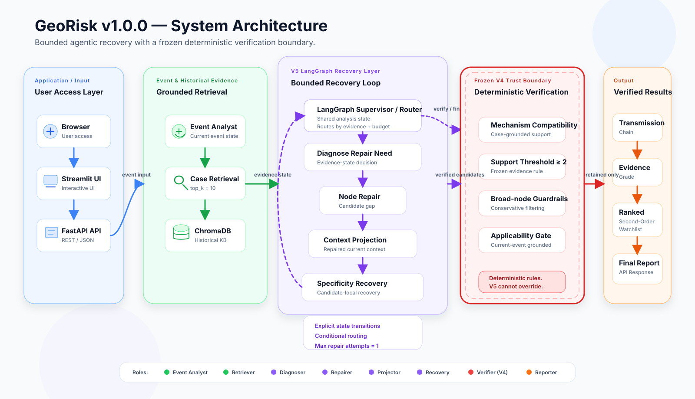

# GeoRisk Transmission Analyzer

**Turn a geopolitical headline into an evidence-backed map of market exposure.**

GeoRisk traces how a conflict, trade restriction, shipping disruption, or supply-chain shock can travel from the obvious first-order impact to less visible downstream exposures. Every result shows the historical cases behind it—and when the evidence is not strong enough, GeoRisk says so instead of forcing a ranking.

> GeoRisk is an analytical research tool. It does not predict prices, recommend trades, or provide investment advice.


## Why GeoRisk?

The first market impact of a geopolitical event is usually easy to spot. A disruption in the Red Sea affects shipping; semiconductor export controls affect chipmakers.

The more useful question is what happens next:

```text
Geopolitical event
        ↓
Operational disruption
        ↓
Supply-chain, cost, or capacity pressure
        ↓
Downstream industries and exposed assets
```

GeoRisk makes that chain visible. It combines structured event analysis, similar historical cases, transmission mechanisms, and a controlled asset universe to produce a watchlist a human can inspect.

## What you get

Give GeoRisk a short event description:

```text
Red Sea shipping routes face disruption due to escalating regional conflict.
```

The report returns:

- a structured summary of the event;
- the closest historical analogs;
- a step-by-step transmission chain;
- direct exposure references for immediate context;
- ranked second-order exposures that pass the evidence checks;
- an evidence label and explanation for every mapped asset.

GeoRisk keeps two kinds of output separate:

| Output | What it means |
| --- | --- |
| **Direct exposure references** | Assets connected to the event's immediate impact. They provide context and are not ranked. |
| **Ranked second-order exposures** | Assets connected through downstream transmission paths that have enough compatible historical support. |

If no second-order exposure clears the evidence bar, the report returns no ranking. That is a valid result—not a system failure.

## Quick start

```bash
git clone https://github.com/ViviLoveAI/Georisk-transmission-analyzer.git
cd Georisk-transmission-analyzer

python -m venv .venv
source .venv/bin/activate
python -m pip install -r requirements.txt

# Build the local retrieval index.
# The embedding model is downloaded the first time.
GEORISK_LOCAL_MODEL_FILES_ONLY=false python -m src.vector_store_health --rebuild
```

Run an analysis from the command line:

```bash
PYTHONPATH=. python -m src.pipeline \
  --news "Red Sea shipping routes face disruption due to escalating regional conflict." \
  --format concise \
  --event-analyzer rule
```

Rule-based analysis works without an API key.

## Run the web app

Start the API in one terminal:

```bash
PYTHONPATH=. uvicorn src.api:app --host 127.0.0.1 --port 8000
```

Start the Streamlit interface in another:

```bash
GEORISK_API_URL=http://127.0.0.1:8000 \
  PYTHONPATH=. python -m streamlit run app.py
```

Then open:

- Streamlit UI: [http://localhost:8501](http://localhost:8501)
- API documentation: [http://localhost:8000/docs](http://localhost:8000/docs)

Prefer Docker? Start both services with:

```bash
docker compose up --build
```

## API example

```bash
curl -X POST http://127.0.0.1:8000/analyze \
  -H "Content-Type: application/json" \
  -d '{"description":"Red Sea shipping routes face disruption due to escalating regional conflict."}'
```

The public API uses the project's verified production configuration. Use the CLI or Python entry points when you need to experiment with analysis settings.

## How it works



| Stage | Role |
| --- | --- |
| **Event Analyst** | Turns a headline into structured regions, industries, risk factors, and affected nodes. |
| **Case Retriever** | Finds relevant analogs in the curated historical-case library. |
| **Transmission Builder** | Builds direct and downstream paths from the event. |
| **Mechanism Check** | Verifies that historical cases share a compatible causal mechanism—not merely a similar label. |
| **Asset Mapper** | Maps exposure nodes only to assets defined in `data/asset_mapping.csv`. |
| **Evidence & Ranking** | Explains support strength and ranks evidence-qualified second-order exposures. |

### Evidence labels

Every exposure is labeled so readers can tell what is supported and what is inferred:

- **`historical_supported`** — retrieved historical cases support the asset or exposure channel;
- **`sector_proxy`** — history supports the broader sector or supply-chain node, but not the exact asset;
- **`inference_only`** — the connection is logically plausible, but the retrieved cases do not corroborate it.

Broad concepts such as `energy` or `logistics` appear across many unrelated events. GeoRisk does not count those repeated words as proof. Historical support contributes only when the underlying transmission mechanism is compatible.

## Optional LLM event analysis

GeoRisk can use an OpenAI model for event structuring and non-English input normalization. Copy `.env.example` to `.env`, then configure:

```bash
OPENAI_API_KEY=your_key_here
USE_LLM_EVENT_ANALYST=true
LLM_EVENT_ANALYST_MODEL=gpt-4.1-mini
```

If the model is unavailable, the application falls back to the rule-based analyzer.

## Project structure

```text
src/agents/                    analysis stages
src/orchestration/             bounded workflow orchestration
src/pipeline.py                CLI and Python entry points
src/api.py                     FastAPI service
app.py                         Streamlit interface

data/historical_cases.json     historical-case knowledge base
data/asset_mapping.csv         controlled asset universe
data/transmission_context_v1.json

scripts/                       evaluation and audit utilities
tests/                         test suite
```

Raw source dumps, downloaded market-price files, generated indexes, and local caches are not included in the public repository. See [Data Policy](docs/DATA_POLICY.md).

## Tests

```bash
pytest -q
```

## Current boundaries

- Results are limited by the coverage of the curated historical cases and asset mapping.
- A plausible transmission path may be omitted when the system cannot find compatible support.
- Mechanism matching is an analytical guardrail, not proof of causality.
- Outputs are designed for human review and should not be treated as forecasts.

## Contributing

Bug fixes, documentation, tests, UI improvements, evaluation tools, and new integrations are welcome. See [CONTRIBUTING.md](CONTRIBUTING.md) before opening a pull request.

Changes to the verified methodology, evidence rules, or ranking behavior should be discussed in an issue first so published behavior does not change silently.

## License

Released under the [MIT License](LICENSE). Originally designed and built by Weiyu Liu.
