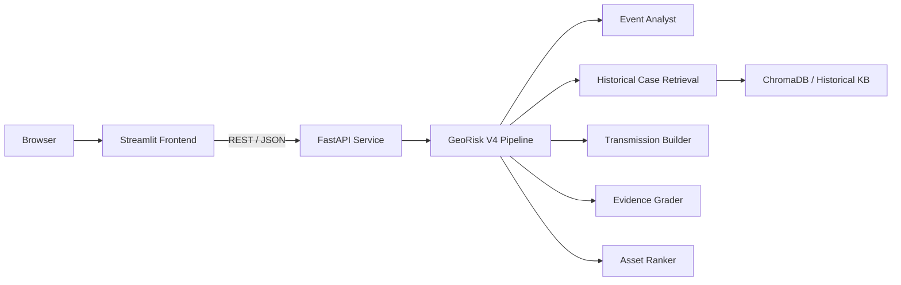
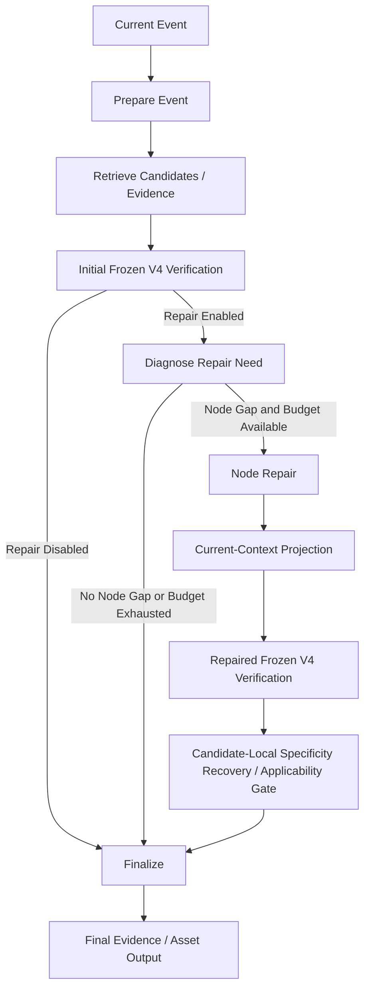

# GeoRisk Transmission Analyzer

GeoRisk maps direct market exposures to geopolitical events and surfaces historically grounded second-order transmission risks.

It is not a stock-price prediction system, trading strategy, or investment-advice tool.

## 1. Why GeoRisk

Geopolitical shocks often create indirect second-order effects: rerouted shipping, energy-trade constraints, export-control spillovers, insurance pressure, critical-mineral bottlenecks, agriculture inputs, or technology-access limits. These paths are hard to trace manually because the relevant evidence may sit in prior events rather than the current headline.

GeoRisk uses structured historical cases and transmission mechanisms to show direct exposure references as baseline context and to rank only evidence-qualified downstream exposures. A valid report may abstain from second-order rankings when no downstream node satisfies V4 support requirements.

## Release Provenance

- Production methodology version: `V4`.
- Current production version: `V4.1`.
- Frozen V5 MVP status: evaluation-frozen bounded agentic discovery layer around the frozen V4 verification boundary.
- V5 LangGraph status: thin orchestration adapter for the frozen V5 state machine; methodology and frozen results are unchanged.
- `V4.1` means V4 downstream retrieval/ranking/evidence methodology plus audited post-freeze implementation and presentation fixes.
- Frozen V4 evaluation artifacts and metrics were not regenerated for `V4.1`.
- The public `/analyze` API currently runs V4/V4.1. V5 is available through the Python/evaluation path and should not be described as the production API.

Post-freeze production fixes are recorded in `data/validation_v4/execution_diagnostics/v4_post_freeze_production_fix_manifest.json`.

## 2. System Architecture



Core implementation:

| Stage | Code | Purpose |
| --- | --- | --- |
| Event Analyst | `src/agents/event_analyst.py`, `src/agents/llm_event_analyst.py` | Structures event type, regions, industries, nodes, risk factors. |
| Retrieval | `src/agents/case_retriever.py`, `src/vector_store.py` | Retrieves analog cases from `data/historical_cases.json` using ChromaDB and `all-MiniLM-L6-v2`. |
| Transmission | `src/agents/transmission_builder.py` | Builds first-order and second-order transmission nodes. |
| Mechanism Context | `src/mechanism_context.py`, `src/transmission_context_store.py` | Applies V4 mechanism-compatible support using `data/transmission_context_v1.json`. |
| Asset Mapping | `src/agents/market_mapper.py` | Maps nodes only to assets in `data/asset_mapping.csv`. |
| Evidence / Ranking | `src/agents/evidence_agent.py`, `src/agents/asset_ranker.py` | Labels support strength and ranks only second-order watchlist candidates. |
| Interfaces | `src/api.py`, `app.py`, `src/pipeline.py` | FastAPI owns the production service boundary; Streamlit is an HTTP client; CLI/Python paths remain available for research and evaluation. |
| V5 LangGraph Orchestration | `src/orchestration/langgraph_v5.py` | Represents the frozen V5 bounded repair workflow as explicit state transitions while reusing existing V5 functions. |

The production V4 path uses simple Python orchestration functions and Pydantic models. V5 also has a thin LangGraph representation for stateful orchestration, conditional repair routing, bounded iteration, and deterministic handoff to the frozen V4 verification boundary.

V5 LangGraph orchestration:



The LangGraph adapter does not introduce new agents, memory, persistence, LLM overrides, or changed evidence semantics.

## 3. Evidence Model

GeoRisk separates “possible exposure” from “historically supported exposure.”

The asset report has two layers:

- Direct Exposure References: assets mapped to the event's direct exposure nodes. They provide baseline/context and are not ranked.
- Ranked Second-Order Exposures: assets mapped to downstream nodes that pass the V4 historical-support and mechanism-compatibility requirements.

| Label | Meaning |
| --- | --- |
| `historical_supported` | Retrieved historical evidence directly supports the asset or the exposure channel strongly enough for the configured support rule. |
| `sector_proxy` | Historical cases support the sector or supply-chain node, but not the exact asset. |
| `inference_only` | The asset maps logically from the node, but retrieved cases do not corroborate the channel. |

Frozen V4 support policy:

- Retrieval depth: `top_k=10`.
- Support threshold: mechanism-compatible support count `>= 2`.
- Historical context sidecar: `data/transmission_context_v1.json`.
- Canonical-family version: `canonical_family_v1`.
- Mechanism compatibility version: `mechanism_compatibility_candidate_v1`.

Repeated node occurrence across retrieved cases is not treated as automatically equivalent evidence. Broad nodes such as `energy`, `logistics`, or `maritime_chokepoint` can create pseudo-consensus when different cases share a node but not a causal mechanism. V4 therefore checks mechanism compatibility before allowing historical support to vote.

## 4. Example

Verified command:

```bash
PYTHONPATH=. python -m src.pipeline \
  --news "Red Sea shipping routes face disruption due to escalating regional conflict." \
  --format concise \
  --event-analyzer rule
```

Observed output summary from the current repository:

- Event type: maritime security disruption.
- Top retrieved historical cases:
  - Red Sea shipping attacks and route diversions.
  - Suez Canal blockage by Ever Given.
  - US East and Gulf Coast port strike.
- Example transmission chain:
  - regional conflict raises route-disruption risk near Red Sea shipping lanes;
  - pressure concentrates in maritime chokepoints, container shipping, freight routes;
  - fuel, insurance, and freight uncertainty widen secondary exposure channels.
- Example evidence-graded outputs:
  - `0144.HK` and `1199.HK` as second-order, `historical_supported`, ports exposure.
  - `BOAT`, `DAC`, `DHT`, `FRO` as first-order reference items.
  - `CB`, `FDX`, `FLNG`, `JBHT` as first-order `sector_proxy` reference items.

This is a risk watchlist for review, not a prediction that any listed asset will move.

## 5. Evaluation

The public release treats the V4 mechanism-aware system as frozen. Metrics below are copied from checked-in artifacts, not from this README prompt.

### Retrieval / Event Understanding

The basic evaluation corpus contains 20 events in `data/evaluation_cases.json`; the hard-case corpus contains 12 events in `data/hard_evaluation_cases.json`.

Top-k sensitivity artifacts show that wider retrieval increases candidate coverage:

| Retrieval depth | Events | Retrieved cases | Support-qualified nodes | Ranked second-order assets |
| --- | ---: | ---: | ---: | ---: |
| `top_k=3` | 44 | 132 | 45 | 90 |
| `top_k=5` | 44 | 220 | 92 | 184 |
| `top_k=10` | 44 | 440 | 217 | 431 |

Source: `data/topk_sensitivity_v4/topk_sensitivity_summary.json`.

### Evidence Aggregation / Ablation

Frozen multi-year benchmark:

- Benchmark version: `georisk_multiyear_general_v1`.
- 23 independent events from 2020-2025.
- 46 `(event, node)` annotations.
- Ground truth: 25 compatible-support expected, 15 weak-cooccurrence expected, 6 insufficient-context expected.

| Metric | V3 | V4 | Delta |
| --- | ---: | ---: | ---: |
| Overall correctness | 17/46 = 36.96% | 21/46 = 45.65% | +8.70 pp |
| Compatible support recall | 2/25 = 8.00% | 2/25 = 8.00% | 0.00 pp |
| Weak-support rejection | 11/15 = 73.33% | 14/15 = 93.33% | +20.00 pp |
| Weak leakage | 4/15 = 26.67% | 1/15 = 6.67% | -20.00 pp |
| Insufficient-context handling | 4/6 = 66.67% | 5/6 = 83.33% | +16.67 pp |

Source: `data/validation_general/results/v3_v4_paired_evaluation_summary.json`.

Interpretation: V4 improves evidence precision and abstention behavior, especially by rejecting weak broad-node co-occurrence. It does not improve compatible-node recall in this benchmark.

### Temporal Held-Out Evaluation

The temporal held-out benchmark freezes the historical KB/configuration before evaluating later unseen events.

- Held-out set: 16 real 2026 events.
- Annotations: 32 `(event, node)` labels.
- Ground truth: 21 compatible, 7 weak, 4 insufficient-context.

| Metric | Result |
| --- | ---: |
| Compatible retention | 3/21 = 14.29% |
| Weak rejection | 7/7 = 100.00% |
| Weak leakage | 0/7 = 0.00% |
| Insufficient-context handling | 3/4 = 75.00% |

Source: `data/validation_v4/results/attempt_002/v4_temporal_mechanism_evaluation_summary.json`.

Compatible-node funnel:

| Stage | Count |
| --- | ---: |
| Compatible ground-truth nodes | 21 |
| Current node proposed | 3 |
| Raw same-node evidence `>=1` in top-10 | 5 |
| Raw same-node evidence `>=2` in top-10 | 5 |
| Current context available | 2 |
| Mechanism-compatible support `>=2` | 2 |
| Final retained | 3 |

Source: `data/validation_v4/results/attempt_002/v4_temporal_compatible_node_funnel_summary.json`.

The main temporal failure mode is upstream of the V4 guardrail: candidate-node proposal and retrieval/vocabulary coverage.

### Frozen V5 MVP Evaluation

V5 adds a bounded agentic node-discovery repair layer, repaired-node current-context projection, candidate-local specificity recovery, and a current-event applicability gate around the frozen V4 verification boundary. It does not change V4 evidence thresholds, asset mapping, ranking semantics, or benchmark labels.

Frozen temporal held-out result:

| Metric | V4 | V5 |
| --- | ---: | ---: |
| Compatible retained | 3/21 | 5/21 |
| False rejection | 18 | 16 |
| Weak leakage | 0 | 0 |
| False acceptance | 0 | 0 |
| Weak rejected | 7 | 7 |
| Runtime failures | 0 | 0 |

Source: `data/validation_v5/recovery_applicability_ab/v5_recovery_applicability_experiment_summary.json`.

### Optional Downstream Market Validation

GeoRisk includes ex-post CAR/SCAR validation artifacts for a frozen legacy/V3 market-validation snapshot. This is optional downstream validation, not the primary V4 evidence result, not a V4 market prediction, and not evidence of tradable performance.

The main descriptive signal uses 12 CAR validation events, 186 activated/evaluable GeoRisk asset-event rows, market-model standardized CAR over frozen event windows, and event-level median `|SCAR|`.

| Group | Aggregate median `|SCAR|` |
| --- | ---: |
| GeoRisk activated | 0.7279 |
| Curated random | 0.6559 |
| Broad random full | 0.6294 |
| Broad random ex-curated | 0.6331 |

Source: `data/market_validation/broad_random/broad_random_summary.json`.

Within the curated asset universe, activated rows showed higher aggregate median `|SCAR|` than non-activated rows:

| Metric | Value |
| --- | ---: |
| Activated rows | 186 |
| Non-activated rows | 736 |
| Activated aggregate median `|SCAR|` | 0.7279 |
| Non-activated aggregate median `|SCAR|` | 0.6465 |
| Relative activation lift | +12.59% |
| Activated > non-activated events | 7/12 |
| Paired sign-flip p-value | 0.2837 |

Source: `data/market_validation/curated_activation/activation_summary.json`.

Interpretation: the market-validation artifacts show a positive but not statistically definitive selectivity signal. They remain ex-post validation signals, not price prediction, causality, or investment performance.

## 6. Temporal Generalization

The temporal held-out design asks whether a frozen historical KB and frozen V4 configuration can handle later geopolitical events without tuning on them. It tests generalization of evidence qualification and node retention under time separation.

The sample is small: 16 events and 32 annotations. The results support a narrow claim: V4 rejects weak co-occurrence well on this held-out set, but compatible-node recall remains low.

## 7. API / Demo

FastAPI:

```bash
PYTHONPATH=. uvicorn src.api:app --reload
```

Open `http://127.0.0.1:8000/docs`.

Production API request:

```bash
curl -X POST http://127.0.0.1:8000/analyze \
  -H "Content-Type: application/json" \
  -d '{"description":"Red Sea shipping routes face disruption due to escalating regional conflict."}'
```

Health and runtime-version checks:

```bash
curl http://127.0.0.1:8000/health
curl http://127.0.0.1:8000/version
```

Streamlit:

```bash
export GEORISK_API_URL=http://127.0.0.1:8000
PYTHONPATH=. python -m streamlit run app.py
```

Docker Compose:

```bash
docker compose up --build
```

Open:

- FastAPI docs: `http://localhost:8000/docs`
- Streamlit UI: `http://localhost:8501`

In Docker Compose, Streamlit calls FastAPI at `http://api:8000` using the Compose service hostname. Local development defaults to `GEORISK_API_URL=http://127.0.0.1:8000`.

Note: production `/analyze` runs the frozen V4 configuration (`top_k=10` with mechanism-compatible support). Callers cannot override retrieval-depth, support-threshold, or mechanism-compatibility settings through the public production API. Configurable `run_pipeline(...)` and CLI paths remain available for research and benchmark experiments.

Runtime `/version` reports both `methodology_version` and `production_version` so current production is not confused with the byte-identical frozen evaluation snapshot.

## 8. Installation

```bash
git clone <repo-url>
cd <repo-directory>
python -m venv .venv
source .venv/bin/activate
python -m pip install --upgrade pip
python -m pip install -r requirements.txt
```

Optional LLM Event Analyst:

```bash
export OPENAI_API_KEY="..."
export USE_LLM_EVENT_ANALYST=true
export LLM_EVENT_ANALYST_MODEL=gpt-4.1-mini
```

Rule-based mode does not require an API key. LLM mode is optional and falls back to the rule-based analyzer if the OpenAI call is unavailable.

Retrieval bootstrap:

```bash
python -m src.vector_store_health --rebuild
```

`src/vector_store.py` uses `sentence-transformers/all-MiniLM-L6-v2`. Runtime defaults to local-only model loading for frozen-test stability. On a clean machine, copy `.env.example` to `.env` or export `GEORISK_LOCAL_MODEL_FILES_ONLY=false` before rebuilding the index so `sentence-transformers` can download the model once.

## 9. Running GeoRisk

Minimal CLI run:

```bash
PYTHONPATH=. python -m src.pipeline \
  --news "Red Sea shipping routes face disruption due to escalating regional conflict." \
  --format concise \
  --event-analyzer rule
```

Local frontend/backend development:

Terminal 1:

```bash
PYTHONPATH=. uvicorn src.api:app --host 127.0.0.1 --port 8000
```

Terminal 2:

```bash
GEORISK_API_URL=http://127.0.0.1:8000 PYTHONPATH=. python -m streamlit run app.py
```

JSON output:

```bash
PYTHONPATH=. python -m src.pipeline \
  --news "The U.S. expands export controls on advanced AI chips and semiconductor equipment to China." \
  --format json \
  --event-analyzer rule
```

Frozen V4 from Python:

```bash
PYTHONPATH=. python - <<'PY'
from src.pipeline import run_v4_pipeline
from src.report_formatter import format_concise_report

report = run_v4_pipeline(
    "Red Sea shipping routes face disruption due to escalating regional conflict.",
    event_analyzer="rule",
)
print(format_concise_report(report))
PY
```

## 10. Running Tests

```bash
pytest -q
```

Focused smoke checks:

```bash
PYTHONPATH=. python scripts/evaluate_pipeline.py
PYTHONPATH=. python scripts/evaluate_hard_cases.py --event-analyzer rule
```

Some optional validation scripts fetch market data through `yfinance` and require internet access. The checked-in CAR artifacts can be inspected without rerunning those downloads.

## 11. Repository Structure

```text
src/
  agents/                 Runtime analysis steps
  validation/             Benchmark and validation implementation
  eval/car/               CAR validation helpers
  pipeline.py             CLI and orchestration entrypoints
  api.py                  FastAPI app

data/
  historical_cases.json   Structured historical KB
  asset_mapping.csv       Candidate asset mapping source of truth
  transmission_context_v1.json
  validation_general/     Primary V3/V4 paired benchmark
  validation_v4/          Temporal held-out validation
  topk_sensitivity_v4/    V4 diagnostics and ablations
  market_validation/      Optional downstream CAR/SCAR validation

scripts/                  Evaluation, audit, and validation commands
tests/                    Pytest suite
app.py                    Streamlit demo
Dockerfile
docker-compose.yml
```

Data policy: raw candidate/source dumps, downloaded market price files, Chroma persistence, and local caches are excluded from public release. See `docs/DATA_POLICY.md`.

## 12. Limitations

- Historical case coverage is finite and curated.
- Results depend on transmission-node representation.
- Current-event node proposal can limit recall.
- Mechanism compatibility uses structured heuristics and an ontology-like sidecar, not causal proof.
- Geopolitical ground truth can be ambiguous.
- Temporal held-out sample size is small.
- CAR/SCAR validation is ex-post market-response validation, not price prediction.
- The system does not provide investment advice.

## 13. Future Work

Future research directions are intentionally not implemented in this frozen release:

- improve current-event node proposal recall;
- improve vocabulary and node alignment;
- retrieve mechanism-level fragments rather than only whole historical cases;
- improve temporal generalization;
- separate compatible-support diagnostics from final-retention logic;
- expand evaluation coverage.

## 14. Metric Provenance

| Claim | Source artifact |
| --- | --- |
| 70 historical cases | `data/historical_cases.json` |
| 82 asset-mapping rows / 78 unique tickers | `data/asset_mapping.csv` |
| Top-k sensitivity table | `data/topk_sensitivity_v4/topk_sensitivity_summary.json` |
| V3/V4 paired benchmark metrics | `data/validation_general/results/v3_v4_paired_evaluation_summary.json` |
| Temporal held-out metrics | `data/validation_v4/results/attempt_002/v4_temporal_mechanism_evaluation_summary.json` |
| Frozen V5 temporal comparison | `data/validation_v5/recovery_applicability_ab/v5_recovery_applicability_experiment_summary.json` |
| Temporal compatible-node funnel | `data/validation_v4/results/attempt_002/v4_temporal_compatible_node_funnel_summary.json` |
| Broad/curated market validation | `data/market_validation/broad_random/broad_random_summary.json` |
| Continuous SCAR analysis | `data/market_validation/scar_continuous_test/continuous_scar_summary.json` |
| Curated activation test | `data/market_validation/curated_activation/activation_summary.json` |

## 15. License

This project is released under the MIT License. See `LICENSE`.

## 16. Contributing & Community

Contributions are welcome for bug fixes, documentation improvements, tests,
UI/usability improvements, additional evaluation tooling, and new adapters or
integrations that preserve the existing evaluation guarantees.

For methodology-changing proposals, please open an issue first. Changes that
affect frozen V4/V5 methodology, evaluation semantics, thresholds, or reported
benchmark numbers must be discussed explicitly and must not silently alter
canonical results.

- Contributor guide: [CONTRIBUTING.md](CONTRIBUTING.md)
- Issues: [GitHub Issues](https://github.com/ViviLoveAI/Georisk-transmission-analyzer/issues)
- Pull requests: [GitHub Pull Requests](https://github.com/ViviLoveAI/Georisk-transmission-analyzer/pulls)

GeoRisk was originally designed and implemented by Weiyu Liu. If you build on
this project, please preserve the applicable license notices and cite or link
back to the original repository where appropriate.

## 17. Community & Downstream Projects

Built something with GeoRisk?

If you adapt GeoRisk for another domain, dataset, interface, or evaluation
setting, open an issue and share what you built. Notable community projects may
be listed here in future releases.
