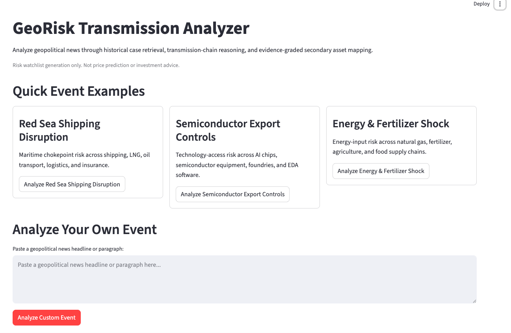

# GeoRisk Transmission Analyzer

A corrective agentic RAG system that analyzes geopolitical news, retrieves historically similar events, builds transmission-chain reasoning, maps affected supply-chain nodes to secondary assets, and generates an evidence-graded risk watchlist.

This project is **not** a stock price prediction system and does **not** provide investment advice. It is designed for geopolitical risk exposure discovery and decision-support analysis. Confidence scores represent evidence strength, not probability of price movement.

## Project Overview

GeoRisk Transmission Analyzer takes a geopolitical news headline or article as input and produces a structured risk transmission report. The system identifies the event type, retrieves relevant historical analogs, builds a qualitative transmission chain, maps affected supply-chain nodes to candidate secondary assets, and grades the evidence behind each mapped candidate.

The key output is a secondary asset watchlist with evidence levels and confidence scores. Candidate assets are treated as possible exposure candidates, not trading signals.

## Problem Statement

Major assets often react quickly to geopolitical events, but secondary assets may be affected through less obvious channels such as supply chains, logistics networks, energy flows, trade restrictions, or technology access constraints.

This system helps identify possible secondary exposure candidates and grounds the analysis in historical geopolitical cases. The goal is to support risk monitoring and decision intelligence, not to forecast asset prices.

## Core Pipeline

```text
News Input
→ Event Analyst Agent
→ Historical Case Retrieval Agent
→ Transmission Chain Builder
→ Market Mapping Agent
→ Evidence Agent
→ Report Agent
→ Streamlit Report UI
```

- **Event Analyst Agent:** extracts event type, regions, industries, supply-chain nodes, and shock direction.
- **Historical Case Retrieval Agent:** uses sentence-transformer embeddings and ChromaDB to retrieve historically similar geopolitical cases.
- **Transmission Chain Builder:** builds a qualitative risk transmission path.
- **Market Mapping Agent:** maps normalized supply-chain nodes to candidate stocks, ADRs, and ETFs using `asset_mapping.csv`.
- **Evidence Agent:** assigns evidence level and confidence score.
- **Report Agent:** generates a structured report for the UI.

## Technical Architecture

- Python
- Streamlit
- Pydantic
- pandas
- sentence-transformers
- PyTorch-backed embeddings
- ChromaDB
- Structured JSON/CSV data layer

## Data Layer

- `data/historical_cases.json` stores structured historical geopolitical risk cases.
- `data/asset_mapping.csv` maps normalized supply-chain nodes to candidate secondary assets.
- Candidate assets are always selected from the asset mapping table; the system should not invent tickers.

## Evidence Levels

- **Historical Supported:** similar historical cases directly support the channel.
- **Sector Proxy:** historical cases support the sector or supply-chain node, but not necessarily the exact ticker.
- **Inference Only:** based mainly on logical mapping with limited historical support.

Confidence ranges:

- `historical_supported`: 0.75-0.90
- `sector_proxy`: 0.50-0.74
- `inference_only`: 0.25-0.49

Confidence reflects evidence strength, not probability of price movement.

## Event Analyst Modes

GeoRisk supports two event-analysis modes:

- **Rule-based analyzer:** deterministic baseline extraction using transparent keyword rules. It is stable, reproducible, and does not require an API key.
- **LLM analyzer:** optional GPT-4.1-mini event analysis for paraphrased, indirect, or implicit geopolitical events. The LLM output is constrained to structured JSON and validated against the project schema and controlled vocabularies.
- **Fallback design:** if the API call, JSON parsing, schema validation, vocabulary checks, or grounding checks fail, the system falls back to the rule-based analyzer.

The LLM analyzer requires local environment configuration. Store keys in `.env` or your shell environment and never commit them:

```bash
OPENAI_API_KEY=...
USE_LLM_EVENT_ANALYST=true
LLM_EVENT_ANALYST_MODEL=gpt-4.1-mini
```

## Example Use Cases

### A. Red Sea Shipping Disruption

Expected outputs:

- Event type: `maritime_security_disruption`
- Historical analogs: Red Sea shipping attacks, Suez Canal blockage, Strait of Hormuz tanker tensions
- Exposure nodes: `maritime_chokepoint`, `container_shipping`, `oil_shipping`, `lng_shipping`, `logistics`
- Example watchlist assets: `BOAT`, `DAC`, `FRO`, `DHT`, `FLNG`, `FDX`

### B. Semiconductor Export Controls

Expected outputs:

- Event type: `technology_export_controls`
- Historical analogs: US semiconductor export controls, Dutch ASML restrictions, Huawei Entity List
- Exposure nodes: `semiconductor_equipment`, `ai_chips`, `eda_software`, `foundry`
- Example watchlist assets: `ASML`, `AMAT`, `NVDA`, `AMD`, `SNPS`, `CDNS`

## Demo Screenshots

### Event Dashboard



### Red Sea Shipping Report


### Semiconductor Export Controls Report


## Evaluation

The MVP regression set evaluates deterministic pipeline behavior on manually defined geopolitical test cases.

Evaluation labels were manually defined for expected event type, expected supply-chain nodes, and relevant historical analogs.

Metrics:

- Event Type Accuracy: 0.90
- Supply-Chain Node Recall: 0.90
- Historical Case Retrieval Recall@3: 1.00

No stock-price movement, returns, or investment-performance metrics are evaluated because the system is designed for exposure discovery, not price prediction.

The main miss involved overlapping maritime-energy chokepoint classification, such as Strait of Hormuz tanker tensions.

## Hard Generalization Evaluation

The hard evaluation set contains 12 cases with paraphrased geopolitical events, ambiguous maritime-energy cases, out-of-domain inputs, and negative non-geopolitical examples.

| Analyzer | Event Type Accuracy | Node Recall | Recall@3 | MRR | Negative Limited-Support Rate |
| --- | ---: | ---: | ---: | ---: | ---: |
| Rule-based | 0.33 | 0.45 | 1.00 | 0.95 | 1.00 |
| GPT-4.1-mini | 0.83 | 0.56 | 1.00 | 0.95 | 1.00 |

GPT-4.1-mini significantly improves event-type classification on hard paraphrased and implicit cases. Node recall improves modestly but remains the main bottleneck because supply-chain exposure expansion requires inferring both first-order and second-order affected nodes. Retrieval remains strong, with Recall@3 = 1.00. The negative limited-support rate remains 1.00, meaning the LLM upgrade did not increase unsupported geopolitical-risk claims on negative examples.

This matters because GeoRisk is more than a simple RAG demo. It is a reusable geopolitical risk knowledge-base pipeline with semantic event analysis, schema validation, human-review-ready structured outputs, fallback reliability, and evaluation on hard cases.

### Current Limitations

- Supply-chain node recall is still conservative.
- More work is needed on node expansion, taxonomy alignment, and alias mapping.
- Future work may include improving prompts, adding node-expansion rules, and comparing GPT-4.1-mini with stronger models.

## Usage Modes

GeoRisk Transmission Analyzer supports three usage modes:

- **CLI:** for local testing and concise report generation.
- **Streamlit Web UI:** the user-facing interactive dashboard and report page. This is the frontend demo for users.
- **FastAPI Backend:** a developer-facing API service that exposes the GeoRisk pipeline through HTTP endpoints. FastAPI `/docs` is for API testing and documentation, not the end-user frontend.

## How to Run

Install dependencies:

```bash
pip install -r requirements.txt
```

Run CLI:

```bash
PYTHONPATH=. python -m src.pipeline --news "Red Sea shipping routes face disruption due to escalating regional conflict." --format concise
```

Run CLI with the optional LLM Event Analyst:

```bash
PYTHONPATH=. python -m src.pipeline --news "Commercial vessels are diverting away from waters off Yemen." --format concise --event-analyzer llm
```

Run Streamlit:

```bash
PYTHONPATH=. python -m streamlit run app.py
```

Run API:

```bash
PYTHONPATH=. uvicorn src.api:app --reload
```

Open API docs:

```text
http://127.0.0.1:8000/docs
```

Health check:

```bash
curl http://127.0.0.1:8000/health
```

Analyze:

```bash
curl -X POST http://127.0.0.1:8000/analyze \
  -H "Content-Type: application/json" \
  -d '{"news_text":"Red Sea shipping routes face disruption due to escalating regional conflict.","top_k":3,"output_format":"concise"}'
```

## Docker

The project includes a lightweight Docker setup for local development. It runs the FastAPI backend and Streamlit UI as separate services and can later be adapted for deployment on AWS EC2.

Build and run:

```bash
docker compose up --build
```

Run in the background:

```bash
docker compose up --build -d
```

Stop:

```bash
docker compose down
```

Open:

- FastAPI docs: `http://localhost:8000/docs`
- Streamlit UI: `http://localhost:8501`

Run evaluation:

```bash
PYTHONPATH=. python scripts/evaluate_pipeline.py
```

Run hard generalization evaluation:

```bash
PYTHONPATH=. python scripts/evaluate_hard_cases.py --event-analyzer both
```

## Project Structure

```text
data/
  historical_cases.json
  asset_mapping.csv

src/
  agents/
    event_analyst.py
    case_retriever.py
    transmission_builder.py
    market_mapper.py
    evidence_agent.py
    report_agent.py
    llm_event_analyst.py
  vector_store.py
  pipeline.py
  schemas.py
  report_formatter.py

scripts/
  evaluate_pipeline.py
  evaluate_hard_cases.py

app.py
README.md
```

## Limitations and Future Work

- Current MVP focuses on shipping chokepoints, semiconductor export controls, energy shocks, trade tariffs, and fertilizer/agriculture input risks.
- Event analysis now supports a deterministic rule-based mode and an optional GPT-4.1-mini mode with schema validation and fallback.
- Expand the historical case base to 20-30+ cases and perform human evaluation on evidence-level calibration.
- Add hybrid retrieval scoring with metadata matching.
- Improve evidence calibration and human evaluation.
- Improve UI reporting for richer event detail pages and historical-case explanations.
- Add more event domains such as rare earth controls, Taiwan Strait risk, Panama Canal drought, Black Sea grain disruption, cyberattacks on infrastructure, and uranium/nuclear supply-chain risk.
- Improve supply-chain node expansion, taxonomy alignment, and alias mapping.

## Disclaimer

This project is for research and educational purposes only. It generates risk watchlists and evidence-grounded exposure analysis. It is not a stock price prediction system, does not predict prices, does not recommend trades, and does not provide investment advice. Confidence reflects evidence strength, not probability of price movement. Candidate assets are risk watchlist items, not trading signals.
